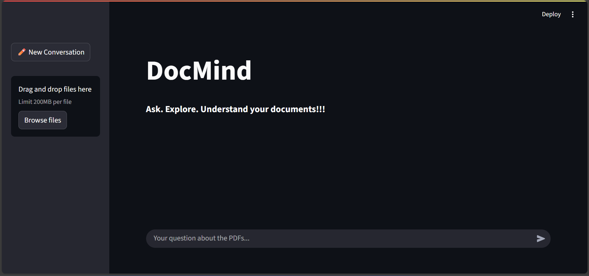
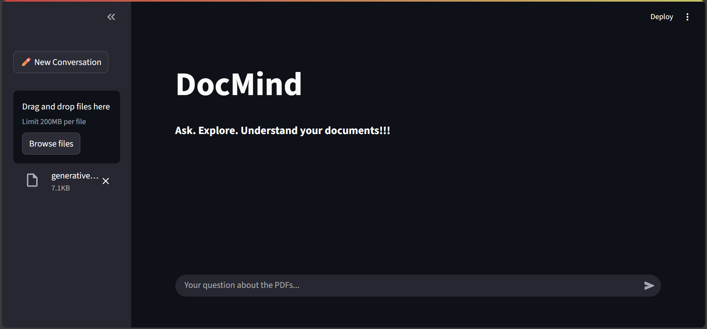
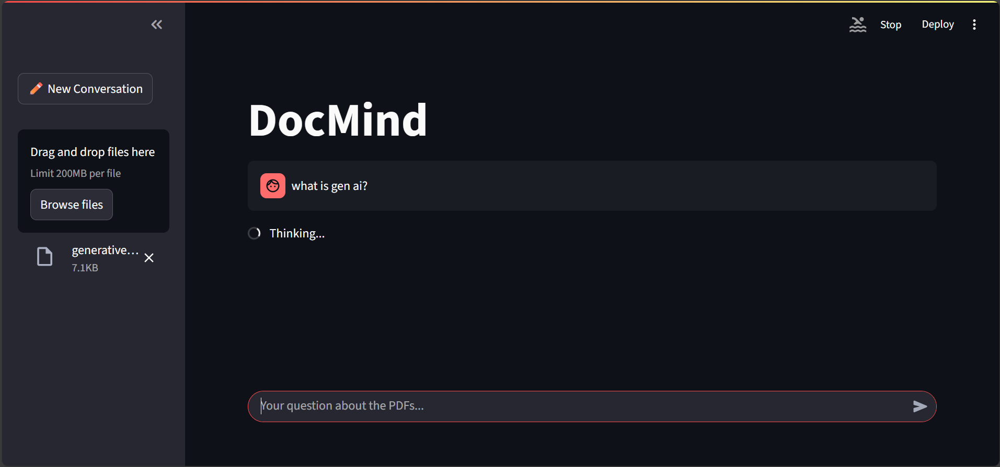
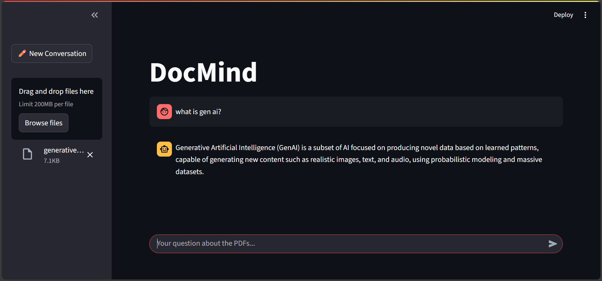
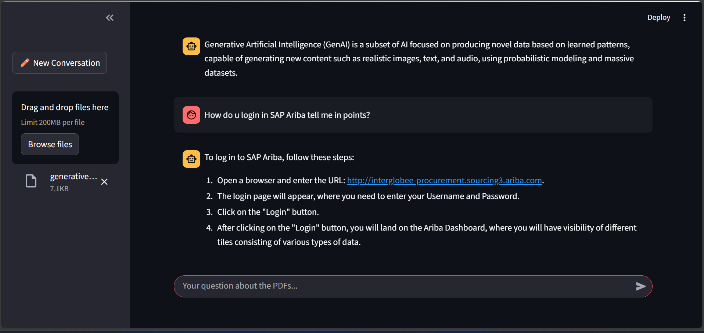
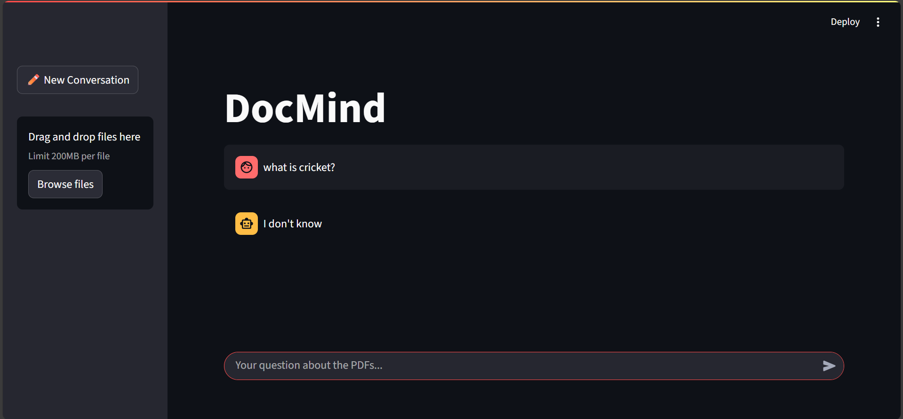
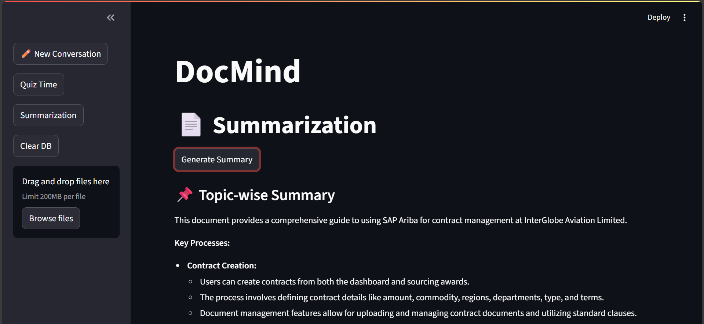
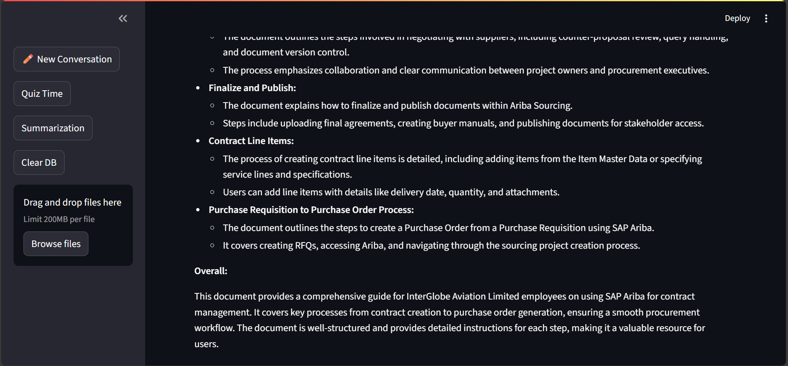
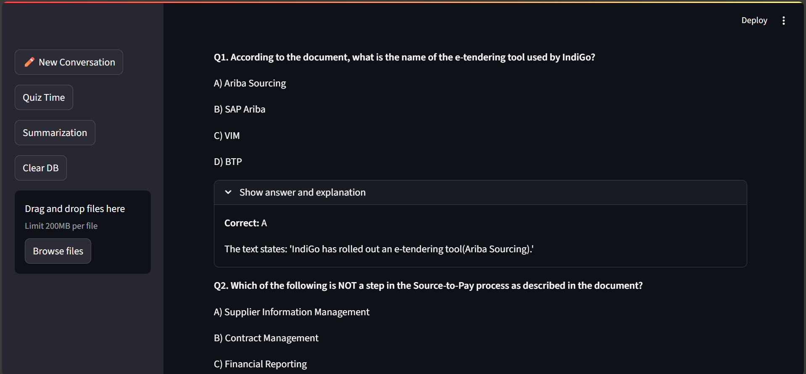

# 📚 DocMind – RAG Study Bot

DocMind is a **Retrieval-Augmented Generation (RAG)** chatbot built with **Streamlit**, **LangChain**, **ChromaDB**, **Ollama Embeddings**, and **Groq LLM API**.  
It allows you to **upload PDFs/TXT files**, store their embeddings locally, and ask questions with context-aware answers.

---

## 🚀 Features
- **Multi-file upload** (PDF & TXT)
- **Local ChromaDB storage** (`./study_db`)
- **Ollama `nomic-embed-text`** embeddings
- **Context retrieval** with top-K similarity search
- **Groq LLM** integration for answering queries
- **Chat history persistence** during a session
- **New Conversation** button to reset state & database

---

## 📂 Project Structure
```
.
├── app.py               # Main Streamlit app
├── .env                 # Environment variables (Groq API key, model name)
├── study_db/            # ChromaDB persisted storage
├── images/
│   └── icon.png         # App icon
├── requirements.txt     # Python dependencies
└── README.md            # Project documentation
```

---

## ⚙️ Setup Instructions

### 1️⃣ Clone the repository
```bash
git clone https://github.com/yourusername/docmind.git
```

### 2️⃣ Install dependencies
```bash
pip install -r requirements.txt
```

### 3️⃣ Set up `.env` file
Create a `.env` file in the project root:
```env
groq_api_key=YOUR_GROQ_API_KEY
model_name=llama3-8b-8192  # Example Groq model
```

### 4️⃣ Run the app
```bash
streamlit run app.py
```

---

## 💡 How It Works
1. **Upload documents** (PDF/TXT) from the sidebar.
2. **Text extraction** – PDFs are read page-by-page, TXT files as a single chunk.
3. **Chunking** – Content is split into 1000-char chunks with 200 overlap.
4. **Embedding** – Chunks are embedded using `nomic-embed-text`.
5. **Vector storage** – Stored in ChromaDB at `./study_db`.
6. **Retrieval** – When you ask a question, the top 5 relevant chunks are fetched.
7. **Augmented prompt** – Retrieved context is sent with your question to Groq LLM.
8. **Response** – LLM generates a context-aware answer.

---

## 🔄 Resetting the Database
Click **Clear DB** in the sidebar to:
- Clear chat history
- Reset the retriever
- (Optional) Delete all stored embeddings

---

## 🖼️ Screenshot
**On StartUp**

**File Uploaded**

**Query Processing**

**AI Response1**


**AI Response2**

**Quiz**

**Summarize**



